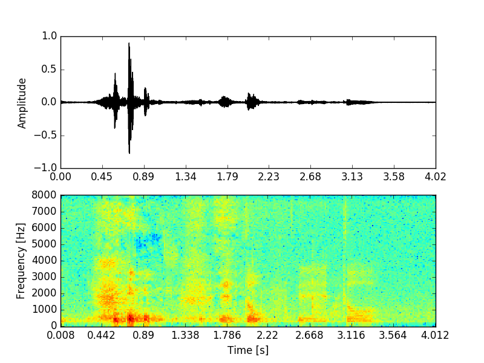

# What is wavshow?
`wavshow` is a command line interface to visualize wavefiles.
You can open multiple audio (wav, flac, ...) files and visualize its waveform and spectrogram.
`wavshow` also supports saving the visualizations as image files.



# Usage
Once you installed this package, you can use
```
wavshow  --help
```

```
Usage: wavshow.py [OPTIONS]

  Plot given wave files and spectrogram.

  Examples:
    (1) Plot a wave file "sample.wav"
        $ wavshow -i sample.wav
    (2) Plot multiple wave files "sample1.wav", "sample2.wav"
        $ wavshow -i sample1.wav -i sample2.wav
    (3) Plot a wave file "sample.wav" and save it as "sample01.png"
        $ wavshow -i sample.wav -o sample%02d.png

Options:
  -o, --outfile TEXT  A file name pattern for help.
  -i, --infiles TEXT  Audio files to plot
  --help              Show this message and exit.
```
to show waveform and spectrogram.

# How to install
```
pip install wavshow
```
